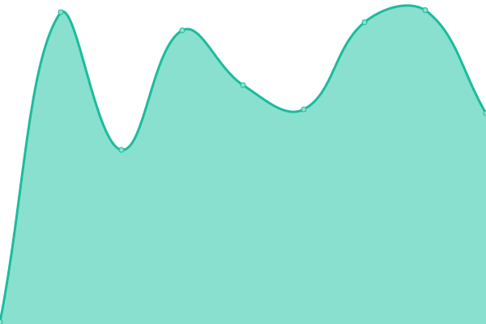

# [📈 Live Status](https://status.bba-tech.ma): <!--live status--> **🟧 Partial outage**

This repository contains the open-source uptime monitor and status page for [Achraf BenBamoula](https://status.bba-tech.ma), powered by [Upptime](https://github.com/upptime/upptime).

With [Upptime](https://upptime.js.org), you can get your own unlimited and free uptime monitor and status page, powered entirely by a GitHub repository. We use [Issues](https://github.com/FrancXPT/upptimer/issues) as incident reports, [Actions](https://github.com/FrancXPT/upptimer/actions) as uptime monitors, and [Pages](https://status.bba-tech.ma) for the status page.

<!--start: status pages-->
<!-- This summary is generated by Upptime (https://github.com/upptime/upptime) -->
<!-- Do not edit this manually, your changes will be overwritten -->
<!-- prettier-ignore -->
| https://status.bba-tech.ma | Status | History | Response Time | Uptime |
| --- | ------ | ------- | ------------- | ------ |
|  MAIN Server | 🟥 Down | [main-server.yml](https://github.com/FrancXPT/upptimer/commits/HEAD/history/main-server.yml) | 

 119ms
     
 | 

<a href="https://status.bba-tech.ma/history/main-server">99.95%</a>
    

|  AFF Server | 🟩 Up | [aff-server.yml](https://github.com/FrancXPT/upptimer/commits/HEAD/history/aff-server.yml) | 

 119ms
     
 | 

<a href="https://status.bba-tech.ma/history/aff-server">100.00%</a>
    

|  PROXY Server | 🟩 Up | [proxy-server.yml](https://github.com/FrancXPT/upptimer/commits/HEAD/history/proxy-server.yml) | 

 120ms
     
 | 

<a href="https://status.bba-tech.ma/history/proxy-server">99.20%</a>
    

|  PR1 Server | 🟥 Down | [pr-1-server.yml](https://github.com/FrancXPT/upptimer/commits/HEAD/history/pr-1-server.yml) | 

 119ms
     
 | 

<a href="https://status.bba-tech.ma/history/pr-1-server">99.96%</a>
    

|  PR2 Server | 🟥 Down | [pr-2-server.yml](https://github.com/FrancXPT/upptimer/commits/HEAD/history/pr-2-server.yml) | 

 0ms
     
 | 

<a href="https://status.bba-tech.ma/history/pr-2-server">0.00%</a>
    

|  TOOLS Server | 🟥 Down | [tools-server.yml](https://github.com/FrancXPT/upptimer/commits/HEAD/history/tools-server.yml) | 

 0ms
     
 | 

<a href="https://status.bba-tech.ma/history/tools-server">0.00%</a>
    

|  WEBPANEL Server | 🟥 Down | [webpanel-server.yml](https://github.com/FrancXPT/upptimer/commits/HEAD/history/webpanel-server.yml) | 

 119ms
     
 | 

<a href="https://status.bba-tech.ma/history/webpanel-server">100.00%</a>
    

<!--end: status pages-->

[**Visit our status website →**](https://status.bba-tech.ma)

## 📄 License

- Powered by: [Upptime](https://github.com/Francxpt/upptimer)
- Code: [MIT](./LICENSE) © [Achraf BenBamoula](https://status.bba-tech.ma)
- Data in the `./history` directory: [Open Database License](https://opendatacommons.org/licenses/odbl/1-0/)
